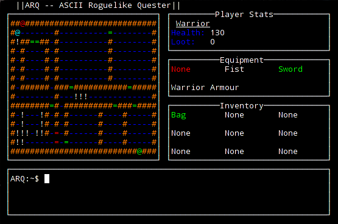

ASCII Roguelike Quester -- Experimental project [C++, Ncurses]
=============================================================
A small learner project using C++ and Ncurses. ARQ is essentially a very basic Roguelike being used to understand and learn new coding and appplication development techniques, with the hope that I might make a game out of it all at the end

LINUX BUILD
===========
Author: Rave Kutsuu   
Version : ~1.0 transition                             
Created: Dec 16, 2012
Last Modified: Dec 01, 

CREDITS
=======
1. The Beginner's Guide to Roguelike Development in C/C++ -- 
http://www.kathekonta.com/rlguide/index.html 

2. NCURSES Programming HOWTO --  
http://www.tldp.org/HOWTO/NCURSES-Programming-HOWTO/                      

TODO (Not in any specific order)
----
1. UI Redesign 
2. Procedural levels (Room and corridor generation in progress! :D)
3. Health System (Player Death menu)
4. NPCs (improved spawning, AI, bosses)
5. Items (potions, scrolls, etc)
6. Level Progression [Repeating step 1 with extras] 
7. Full ending (Dungeon escape?)
8. Menu
9. Load game/item maps from files
10. Mild redesign/re-implementing the battle system

Notes-- 
Armour system -- Armour modifier == (DAM(Weapon)-(DAM(Wep)/100*AP) rounded) .. Armour reduces incoming damage by that percentage

EXTRAS
------
(Windows, Sound? (Ambient music), Break down doors, disarm/dodge traps,etc)

Changelist (~1.0) ongoing (see below for updates until >1.0)
----------------

25/07/16
--------
It's been 7 months! I've overhauled and changed a lot in my spare time, the item system still needs to be finished (w/ loot scattering and such), and the map levels also need some work to 
allow larger/fixed size maps that pan on smaller screens/windows.

* Major changes were made on branch 'arq2' which has been rebased onto 'master', so everything should look nice on Github now!
* I'm NOT removing TODOs 1,2,6, or 8 yet, as they all have a bit more to do.
* I've added TODO 10 as a reminder to fix/improve/re-implement the battle system (As this will likely remain until items 3,4, and 5 are done)

Changelist(0.90)
-----------------
1. Lots of fixes and refactoring
2. Added a "pause" menu and start menu w/ fog of war setting
3. Inventory now works in a list format! (The entire item system still needs some work)
4. Maps are now prodecurally generated using A* to path between them! (Needs expansion w/ view panning)
5. There are now multiple levels thanks to procedural generation! Previous levels are stored too.

01/12/15  
--------
1. After major refactoring of the UI, I'm redesigning the overall UI layout to be more futureproof. A few points worth noting are
     * Player inventory will now be displayed in a list format, instead of the original 3x3 inventory window
     * Each player class will have a weight limit for the items they carry
     * The player can store as many items as they want up to this limit in weight

Changelist (0.89a)
-------------------

**GAMEPLAY**
1. You can now swap items between containers
2. Added the ability to store multiple items in one area
3. Added a placeholder for a new Goblin subtype (The Beserker, I'll add his AI later.)

**CODE**
1. Finished container implementation
2. Fixed major character death bug (bodies respawning)
3. Fixed container accessing issues

Changelist (0.89)
-----------------

**GAMEPLAY**
1.Added lootable containers/dead bodies
2.Added the ability to put player inv items into containers
3.Characters drop their equipment on death

**CODE**
1.Added containers
2.Reworked inventory system to work using containers
3.Added a secondary AcessInv function specifically for the player's inv
4.Further improvements to player movement
5.Changed indent style to GNU standard.
6.Cleaned up UI code/fixed refresh issues

Changelist (0.88)
-----------------

**GAMEPLAY**
1. Added the ability to Flee when in combat

**CODE**
1. Improved player Move(WINDOW * winchoice, WINDOW* mainwin, int y, int x)
2. Added Traversable Tile check and TileProc() (Abstracted from Move())
3. SPLIT CODE INTO HEADERS AND MULTIPLE SOURCE FILES
4. REWORKED MAJOR FUNCTIONS TO SUPPORT THE ABOVE

Changelist (0.87)
-----------------

**GAMEPLAY**
1.Fixed bug with NPCs not dying
2.Added corpses/modified NPC symbol
3.Small improvements to movement feedback
4.Reworked inventory layout to fix item name bug
5.Fixed an item pickup bug caused by 0.85-2
6.Added equipment window
7.Added outfits/armour

**CODE**
1.Updated item system enums and listings 
2.Fixed bad naming conventions
3.Cleaned up main() and added init functions
4.Gave WINDOW*'s global scope

Changelist (0.86)
-----------------
1.Fixed item pickup bug

Changelist (0.85)
-----------------

1.Improved documentation
2.Ablity to walk over items
3.Fixed inventory to work with the new item system
4.Added the ability to fight/kill NPCs
5.Fixed death

